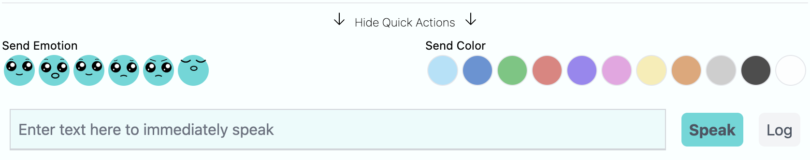

## Quick Actions

Sometimes you want the robot to express something or you want to track something that hasn't already been created for you to select. In those scenarios, you can use the Quick Actions section of the controller:

The quick actions section allows you to send individual emotions, colors, speech / verbal expression, or even track a log. This is exactly the same as a message or log button but deciding on each part of the expression on its own.

> **Pro Tip**: If you're trying to have the robot say something, you'll probably need to type it quickly. We recommend having buttons already created ahead of time that have the robot make time for you to type. We call those "Ignorance Comments" where the robot might say something like "Hmm, let me think about that" and claim ignorance for a bit until you have a response.
